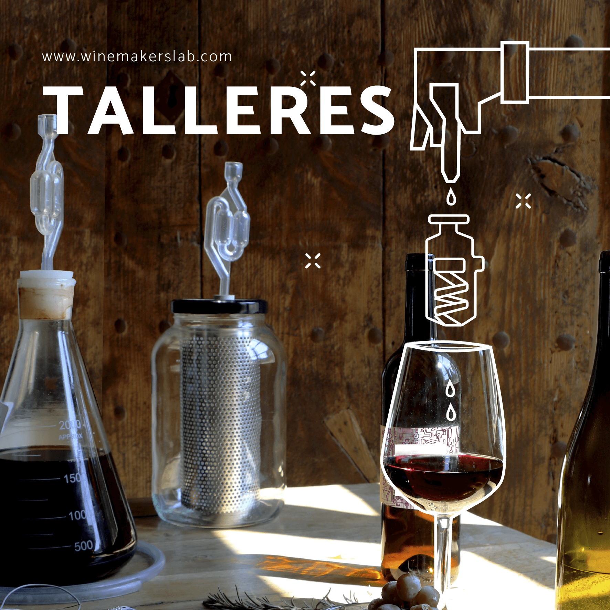

    

        

            
            

                

                    <h5 class="text-center text-uppercase mt-5">TALLERES</h5>
                    
Talleres para aprender a hacer tu propio vino.

                    
¿Que necesitas para poder explorar y aprender a hacer un vino?

                    
Las uvas para fermentar los utensilios donde hacer las fermentaciones, la estabilización y las crianzas de sus resultados un sencillo laboratorio donde poder hacer los análisis que nos ayuden a acompañar el proceso.

                    
Podrás hacer vinos “tranquilos” como tintos, blancos y rosados, y vinos espumosos como los Ancestrales de una sola fermentación a los cavas de dos fermentaciones.

                    
Y en cualquier momento del año, porque cada vendimia empaquetamos y guardamos las uvas en congeladores a -18º.

                    

                        <a class="btn btn-outline-dark" href="talleres.md" target="_blank">Próximos talleres</a>
                    

                

            

        

        

            
            <h5 class="text-center text-uppercase mt-5">WINE LAB</h5>
            

                

                    
Todos los recursos del Fab Lab para que puedas diseñar y fabricar los utensilios, hacer los sensores e instrumentos que la viticultura personal te pueda requerir.

                    
Construye tu filtro para mantener las pieles húmedas y en contacto con el mosto durante la fermentación.

                    
Midiendo densidades durante la fermentación sin la utilización de probetas y densímetros.

                    
Hacking de una nevera de camping para fermentar a temperaturas controladas.

                    
Bioplásticos con los hollejos de las uvas, una apuesta por las economías circulares.

                    
Construyamos de un agitador para la estabilización del vino en el matraz de descube.

                    
Introducción al uso de las herramientas básicas del Fab Lab (impresoras 3D, Cortadora láser, y Arduino).

                    

                        <a class="btn btn-outline-dark" href="" target="_blank">Próximos talleres</a>
                    

                

            

        

    

</body>
</html>